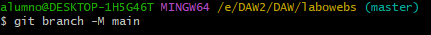
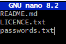
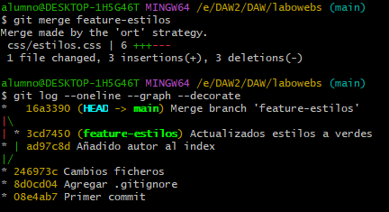
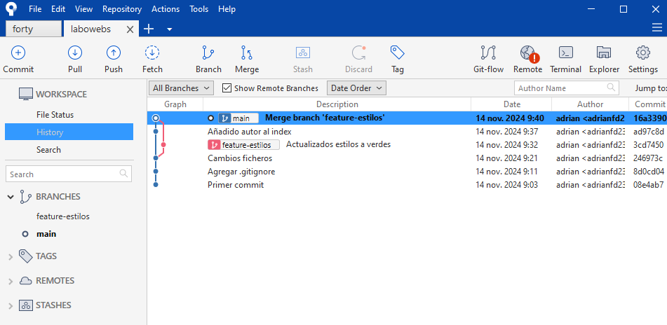

# Git - Tarea Labowebs

> Adrián Fernández Díaz

[TOC]

## Trabajo en local

Trabajo individual en tu ordenador

### Cuestiones:

1. Inicializa un nuevo repositorio Git en una carpeta llamada "labowebs" y agrega los archivos proporcionados en el aula virtual. Renombra la rama master a main , si es necesario. Realiza el primer commit. Muestra el log del repositorio.

```bash
git init
git branch -M main
git add .
git commit -m "Primer commit"
git log --oneline
```





2. Incluye un fichero .gitignore para que los ficheros README.md , LICENCE.txt y passwords.txt sean ignorados por el control de versiones. Realiza el commit y muestra los logs del repositorio en una línea.

```bash
nano .gitignore
git add .gitignore
git commit -m "Agregar .gitignore"
git log --oneline
```




3. En el repositorio, crea los archivos README.md , LICENCE.txt y passwords.txt con algún contenido. Muestra el estado del repositorio. Muestra el listado de archivos ignorados.

```bash
nano README.md
nano LICENCE.md
nano passwords.txt
git status
git status --ignored
```


4. Crea una rama feature-estilos . Cámbiate a ella. 

   - Modifica el archivo estilos.css : 

     - propiedad color del body y de h2 : #2a2a2a 

     - propiedad background-color de header y footer: #2a75ff

     - Comprueba el estado del repositorio. Añade los cambios, realiza un commit con el mensaje "actualizados estilos a azules"

```bash
git branch feature-estilos
git checkout feature-estilos
git status
git add estilos.css
git commit -m "actualizados estilos a azules"
```


5. Vuelve a la rama main . En el archivo index.html añade un comentario donde se indique tu nombre como autor de la página. Comprueba el estado del repositorio. Añade los cambios, realiza un commit con el mensaje ' añadido autor en index'. Muestra los logs del repositorio en una línea, gráficamente y con 'decoración'

   ```bash
   git checkout main
   git status
   git add index.html
   git commit -m "añadido autor en index"
   git log --oneline --graph --decorate
   ```

   


6. Fusiona la rama feature-estilos en la rama main . Muestra los logs del repositorio en una línea, gráficamente y con 'decoración'

   ```bash
   git merge feature-estilos
   git log --oneline --graph --decorate
   ```

   



## Trabajo en remoto

Esta parte se realizará con la herramienta gráfica Sourcetree y con GitHub .

### Cuestiones:

1. Continúa con el repositorio labowebs . Añade el repositorio a Sourcetree



2. Crea un repositorio remoto y sube al remoto los ficheros de tu repositorio local. Debes
    subir todas las ramas.

  


3. Crea una rama feature-index . Añade el siguiente código dentro de la <section class="about"> . Añade los cambios y crea un commit. Sube los cambios al remoto.

   


4. En el repositorio local, fusiona la rama feature-index en la rama main .

   


5. Edita el fichero contacto.html . Borra unas líneas. Muestra los ficheros con cambios pendientes y las diferencias. Añade los cambios y haz un commit.

   


6.Te das cuenta del error. Deshaz el commit anterior. Captura el estado actual del repositorio.


7. Crea una rama feature-mapa . Incluye este código en el archivo contacto.html . Añade los cambios. Realiza un commit. Sube los cambios al remoto. Muestra en el remoto los cambios del archivo contacto.html en la rama feature-mapa .


8. En GitHub, en la rama main , fusiona la rama feature-mapa . Baja los cambios del remoto a local. Deja los dos repositorios sincronizados.


## Conflictos

### Cuestiones:

1. Crea una rama hotfix-js . Cámbiate a ella. Añade este código en el fichero script.js . Confirma el cambio y haz un commit. (Fíjate en los números de línea...)


3. Fusiona la rama hotfix-js en main . Debe producirse un conflicto. Resuélvelo. Cuando termines la resolución del conflicto sube los cambios al remoto - Deja los repositorios sincronizados


Al hacer el merge crea un conflicto. Para solucionarlo fusionamos los dos codigos


Fusionamos las ramas y subimos a local y después a remoto.


Aqui dejo la url de mi repositorio remoto:

https://github.com/adrianfd23/labowebs24.git
